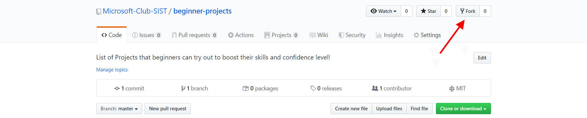

# CONTRIBUTING GUIDELINES
- Fork this Repository. This will create a Local Copy of this Repository on your Github Profile. 

- Go to the Solutions Folder and create a New Folder by keeping your Name as the Folder Name. Include your credentials in this New Folder
by creating a new Readme File and later move onto creating a seperate sub-folder for the project's code. Once done, you will have now the option of creating a Pull Request. 

- Click on the Option to create a Pull Request. All the changes that have been made in your Local Repository will now be pushed into the 
Main Repository. 

- Add the necessary details and voila! Your Pull Request has been submitted and will be reviewed by the moderators and merged :smiley:

You can refer to the following articles on basics of Git and Github and also contact our Moderators, in case you are stuck: 

- [Forking a Repo](https://help.github.com/en/github/getting-started-with-github/fork-a-repo)
- [Cloning a Repo](https://help.github.com/en/desktop/contributing-to-projects/creating-a-pull-request)
- [Getting started with Git and GitHub](https://towardsdatascience.com/getting-started-with-git-and-github-6fcd0f2d4ac6)
